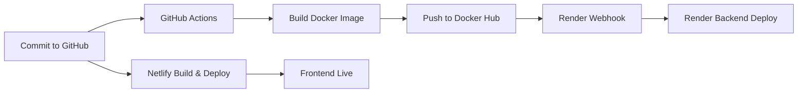

# 🎓 MERN Student Attendance Management System

## 📌 Overview

A **Full-Stack Student Attendance Management System** built with the **MERN stack**.  
It enables teachers to manage students, track attendance, and enforce **role-based access control** with a modern, responsive UI.

---
## 🧑‍💻 Demo Credentials

Use the following credentials to explore the application:

### 👩‍🏫 Teacher Login
- **ID:** `t001`  
- **Password:** `abc@123`

### 🎓 Student Login
- **ID:** `std_1`  
- **Password:** `linus@123`

⚠️ *These demo accounts are provided only for testing purposes.*

---
## 🎥 Demo

---

## ⚡ Technical Highlights

- Built with **MERN Stack** (MongoDB, Express.js, React, Node.js)  
- Secured with **bcrypt** for password hashing & **JWT** for authentication  
- Input validation handled using **express-validator**  
- Styled with **Tailwind CSS** for responsive and modern UI design  
- Version controlled with **Git & GitHub** for collaboration and source management 

---
## 🚀 Deployment Workflow

This project follows a **professional-grade CI/CD pipeline**:

🔄 **Flow**

- Commit pushed → GitHub Actions runs  
- **Backend**: Docker image built → pushed to Docker Hub → Render auto-deploys via webhook  
- **Frontend**: Netlify auto-builds & deploys React app  

---

🔒 **Environment Variables**

Both **frontend (Netlify)** and **backend (Render)** use environment variables for sensitive data (MongoDB URI, JWT secrets, API keys).  
➡️ No secrets are exposed in the codebase.  

---

🛠️ **Tech Stack**

- **Frontend**: React, Tailwind CSS, React Router DOM  
- **Backend**: Node.js, Express.js  
- **Database**: MongoDB + Mongoose  
- **Authentication**: JWT, bcrypt  
- **Validation & Security**: express-validator, sanitization  
- **Deployment**: GitHub Actions, Docker, Docker Hub, Render, Netlify  

---

✨ **Features**

👩‍🏫 **Teacher**  
- Add / delete students  
- Mark and update attendance  
- View student records in a dynamic table  

🎓 **Student**  
- Secure login  
- View personal attendance records  
- Track attendance percentage    

---

# 📘 Project Journey – Student Management System (Commit by Commit)

This project documents my journey of building a **Full-Stack Student Management Application** step by step, commit by commit.  
The app enables teachers to manage attendance and students to view their records securely.  

---

### [Commit 1 – Initial Setup](https://github.com/R-pradeep2005/Student-attandance-management/commit/3a7c0f6a3ec2257795ecd8431b0c54a0b7a58e87)
- Bootstrapped the project using **Vite** for fast frontend development.  

---

### [Commit 2 – Git Configuration](https://github.com/R-pradeep2005/Student-attandance-management/commit/ea4a2968eb03fb6490a39b3a4785e5ab0697643e)
- Added `.gitignore` to exclude unnecessary project files.  

---

### [Commit 3 – TailwindCSS Setup](https://github.com/R-pradeep2005/Student-attandance-management/commit/5188ae1304cf4ad57a81953f40effd0f17e9b245)
- Installed **@tailwindcss/vite**.  
- Imported Tailwind into `index.css`.  
- Configured `vite.config.js` with Tailwind plugin.  

---

### [Commit 4 – Core Components (Login & Teacher Dashboard)](https://github.com/R-pradeep2005/Student-attandance-management/commit/3ac2500645905ca30a50a927d9567c2cdceb2d32)
- Created **Login component** with role toggle (student/teacher), input fields, and submit button.  
- Built **Teacher component** to display students’ attendance in a table format.  
- Faced a challenge: dates were stored in an array, attendance as `{date: status}`.  
- Solved it by mapping dates and matching keys.  
- Designed a scrollable table with fixed student info + scrollable attendance.  

---

### [Commit 5 – Editable Attendance](https://github.com/R-pradeep2005/Student-attandance-management/commit/92f05c7137c1597806e1e223a9a401472d5ac39f)
- Made attendance **editable** using `<input>`.  
- Used immutable state updates for data consistency.  

---

### [Commit 6 – Add Students & Student Dashboard](https://github.com/R-pradeep2005/Student-attandance-management/commit/2001266f26e6d94d45a257aa3cd2602aac85dfec)
- Added **AddStudent page** for teachers.  
- Created **Student page** to view attendance percentage and details.  

---

### [Commit 7 – Routing & Attendance Percentage](https://github.com/R-pradeep2005/Student-attandance-management/commit/5ba926a24a4c617961890020ac2aedc9cf4d9c54)
- Installed **React Router DOM**.  
- Setup navigation routes.  
- Implemented attendance percentage calculation.  
- Added logout functionality.  

---

### [Commit 8 – Backend Setup](https://github.com/R-pradeep2005/Student-attandance-management/commit/b5bea0e5ca1b6e1f8e00e7f45def4a0250272757)
- Initialized **Express.js server**.  
- Configured to listen on port 5000.  

---

### [Commit 9 – CORS & Login API](https://github.com/R-pradeep2005/Student-attandance-management/commit/f6659e04939c9f353aa6daf1fe561dca98fdeae2)
- Installed **CORS** for client-server communication.  
- Created login API route.  
- Used `FormData` + Fetch API for requests.  

---

### [Commit 10 – Fetch Student Data](https://github.com/R-pradeep2005/Student-attandance-management/commit/95df7d9fe260f686218fc4d3973d85d785703d0c)
- Implemented **GET API** to fetch student data as JSON.  

---

### [Commit 11 – Attendance Update](https://github.com/R-pradeep2005/Student-attandance-management/commit/b1f2906b13103fb03a1548401f8010c98c87344b)
- Displayed attendance in Teacher Dashboard using `useEffect`.  
- Added PUT API for updating attendance immutably.  

---

### [Commit 12 – Add Student API](https://github.com/R-pradeep2005/Student-attandance-management/commit/8596340b460120714f28bd9b7374fd8553f69b90)
- Implemented POST API for adding students.  
- Converted `FormData` into objects using `Object.entries()`.  

---

### [Commit 13 – MongoDB Integration](https://github.com/R-pradeep2005/Student-attandance-management/commit/c285e1040ca988c2e5017e6334ad7a67ad27c6ae)
- Connected Express server to **MongoDB (Mongoose)**.  
- Secured DB credentials using `.env`.  

---

### [Commit 14 – Schema & Models](https://github.com/R-pradeep2005/Student-attandance-management/commit/0a1690932edd09916ce1aadbed7eed4b1e44b991)
- Defined **Mongoose schema** with validation.  
- Created Student model.  

---

### [Commit 15 – Add & Fetch Students](https://github.com/R-pradeep2005/Student-attandance-management/commit/d68e4ae72ca8bd0220278c4006db722a0d55364d)
- Added students to DB using `.save()`.  
- Fetched using `.find()`.  

---

### [Commit 16 – Authentication](https://github.com/R-pradeep2005/Student-attandance-management/commit/0887332ea874e89fdd49f52e9672d52b1662799b)
- Implemented **auth** for teacher/student.  
- Compared entered password with DB.  

---

### [Commit 17 – Auto Student ID Generation](https://github.com/R-pradeep2005/Student-attandance-management/commit/d2b40cfd36c990399849b2d7af56ac3ab7fabbef)
- Auto-generated IDs (`std_001`, `std_002`).  
- Used MongoDB `$inc` counter.  

---

### [Commit 18 – Enhanced UI](https://github.com/R-pradeep2005/Student-attandance-management/commit/647d782528ec27845e465dbdcbcc4ca8c6f9e206)
- Popup after student creation (Add another OR Back).  

---

### [Commit 19 – Sync Teacher Dashboard with DB](https://github.com/R-pradeep2005/Student-attandance-management/commit/dc44ea095fa57f77bda7f88fb1a6abf3a0ddf047)
- Teacher Dashboard fetches live data.  
- Updates synced with DB via `findOneAndUpdate()`.  

---

### [Commit 20 – Error Handling](https://github.com/R-pradeep2005/Student-attandance-management/commit/836130c5502442b0ca5c56db05c35400c1505644)
- Displayed total student count.  
- Error alerts for wrong passwords.  

---

### [Commit 21 – Student Deletion](https://github.com/R-pradeep2005/Student-attandance-management/commit/75e69b8df8fd321e54beb9d7b51dcb3008c5cf11)
- Enabled **multi-delete** via checkboxes.  
- Used `Promise.all()` to handle DB deletions.  

---

### [Commit 22 – Student Authentication](https://github.com/R-pradeep2005/Student-attandance-management/commit/c0bb42f75e9c5e3c682636771871947c75aef707)
- Verified student login using DB check.  

---

### [Commit 23 – Dynamic Student Dashboard](https://github.com/R-pradeep2005/Student-attandance-management/commit/0e25cf6df2e047527528525100f14f236709370c)
- Passed student ID via `useNavigate`.  
- Fetched correct student data with `useLocation`.  

---

### [Commit 24 – Password Hashing](https://github.com/R-pradeep2005/Student-attandance-management/commit/7c749cabeb111ec7c1384b01ce78ed49006dd936)
- Integrated **bcrypt** for password hashing.  
- Verified login with hash comparison.  

---

### [Commit 25 – JWT Authentication](https://github.com/R-pradeep2005/Student-attandance-management/commit/b71ef277ed8768c2ae4173a9792285809ec88107)
- Implemented **JWT tokens**.  
- Middleware to verify tokens before accessing routes.  

---

### [Commit 26 – Role-Based Access](https://github.com/R-pradeep2005/Student-attandance-management/commit/d6d5207005c377c220308d56933111141b8b8e1c)
- Restricted teacher dashboard to **teacher role only**.  

---

### [Commit 27 – NoSQL Injection Protection](https://github.com/R-pradeep2005/Student-attandance-management/commit/208fa043fd177272c1209b90317cd402ce5da69a)
- Used **express-validator** (`escape()`, `trim()`).  
- Sanitized all inputs before DB save.  

---

### [Commit 28 – Final UI Enhancements](https://github.com/R-pradeep2005/Student-attandance-management/commit/d95283ae261813416aa58775d037adb2bfc89f29)
- Added **dark mode**.  
- Attendance styling:  
  - ✅ Present → Green  
  - ❌ Absent → Red  

---

🚀 **Final Thoughts**  

This project evolved from a simple CRUD app into a secure, scalable, production-ready MERN application.  

It demonstrates:  
- Building & securing full-stack apps  
- Real-world CI/CD with Docker + GitHub Actions + Render + Netlify  
- Strong focus on security, scalability, and clean UI/UX  

📌 This project showcases both my technical expertise (**MERN stack, DevOps, security**) and my ability to deliver a **professional-grade deployment pipeline**.  

